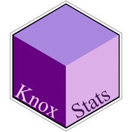

# KnoxStats 📊

<div align="center">


<p>&nbsp;</p>


**A Pedagogical R Package for Learning Statistics Through Practice**

[](https://cran.r-project.org)
[](https://www.rstudio.com)


[](https://www.gnu.org/licenses/gpl-3.0)


</div>

<p>&nbsp;</p>
<p>&nbsp;</p>
<p>&nbsp;</p>


## 🎯 Overview

KnoxStats is an educational R package designed specifically for undergraduate statistics students learning R for the first time. The package provides intuitive, well-documented functions that make statistical concepts tangible through practical implementation.

> **Learning statistics should be about understanding concepts, not wrestling with code complexity.**

<p>&nbsp;</p>

## ✨ Key Features

- **Beginner-Friendly Functions**: Clear parameter names and comprehensive error messages
- **Practical Examples**: Real-world datasets and scenarios students can relate to
- **Educational Documentation**: Each function explains the "why" behind the "how"

<p>&nbsp;</p>

## 📦 Installation

You can install the development version from GitHub:

```r
# Install devtools if you haven't already
install.packages("devtools")

# Install KnoxStats
devtools::install_github("ojforsberg/KnoxStats")
```

 <p>&nbsp;</p>

## 🏫 Designed for the Classroom

### Features That Help Students Learn:

1. **Plain Language Outputs**: Statistical results explained in simple terms
2. **Step-by-Step Mode**: Optional detailed output showing calculations
3. **Common Mistakes Prevention**: Helpful error messages when students make common errors
4. **Learning Objectives**: Each function clearly states what concepts it teaches
5. **Practice Exercises**: Built-in exercises with solutions

View the full documentation at: [https://github.com/ojforsberg/KnoxStats](https://github.com/ojforsberg/KnoxStats)

<p>&nbsp;</p>

## 📄 License

This package is released under the GPL-3 License. See the [LICENSE](LICENSE) file for details.

<p>&nbsp;</p>

## 📞 Support & Community

- **GitHub Issues**: Report bugs or request features
- **Discussions**: Ask questions and share teaching ideas
- **Email**: ojforsberg@knox.edu

<p>&nbsp;</p>


## 🙏 Acknowledgments

KnoxStats was developed with support from:
- Knox College of Illinois
- Feedback from hundreds of undergraduate students

---
<p>&nbsp;</p>

**Made with ❤️ for statistics education**
<p>&nbsp;</p>
<p>&nbsp;</p>

*"The best way to learn statistics is to do statistics."*

<p>&nbsp;</p>
<p>&nbsp;</p>
<p>&nbsp;</p>
